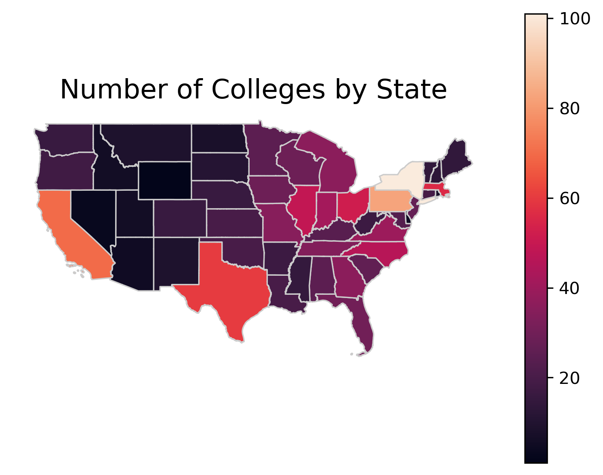

## Technologies Used
* Python
* Pandas
* GeoPandas
* MatPlotLib
* Seaborn
* D-Tales
* Panda Profiling
* ScKit Learn (Basic ML)
* PowerPoint

[Requirements File](./requirements.txt)

## Raw Data

​* [Raw Data](./data/original_data/Universities.xlsx)
* [Shape Files](./data/original_data/)

## Analysis Files
* [D-tale EDA Notebook](./notebooks/D-Tale-self-service.ipynb)
* [Panda Profiling EDA Notebook](./notebooks/Panda_profiling.ipynb)
* [Rudimentary ETL with Additional Data Sources](./Additional_data_Gathering.ipynb)
* [Core Analysis](./analysis.ipynb)
* [PCA Reduction](./pca_reduction.ipynb)

## Final Analysis
* [PDF Version](./presentation/US_News_and_reports_2016_colleges.pdf)
