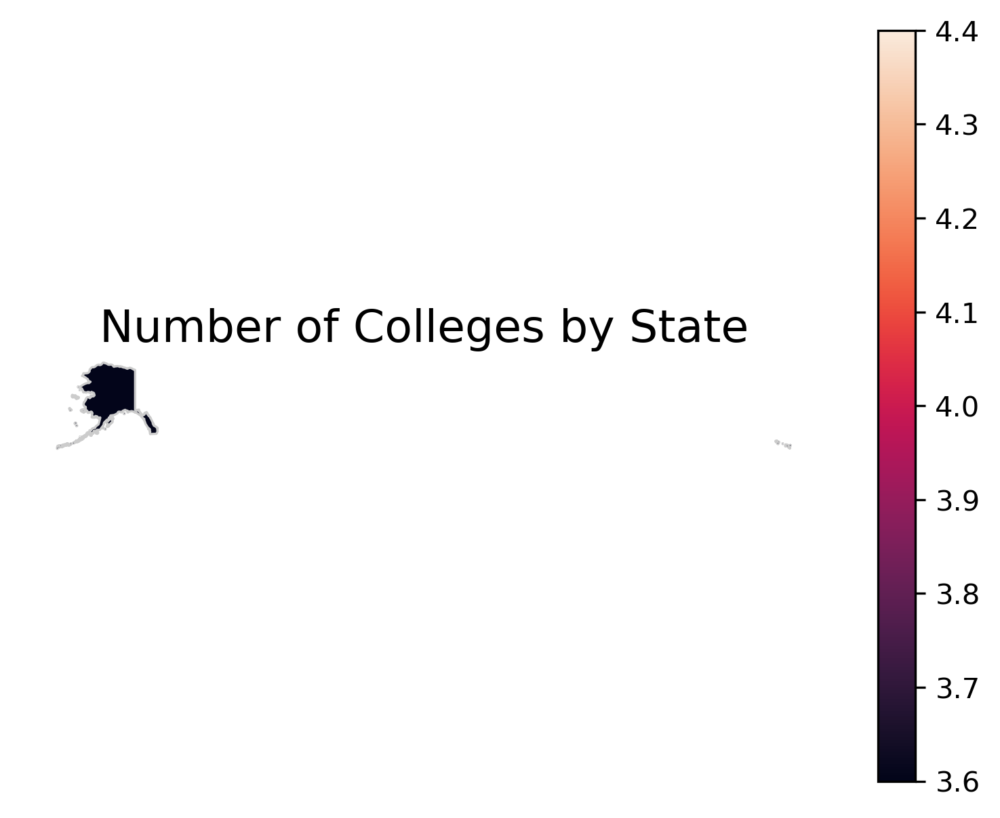
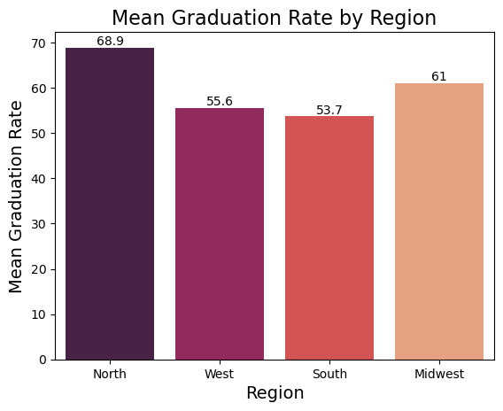
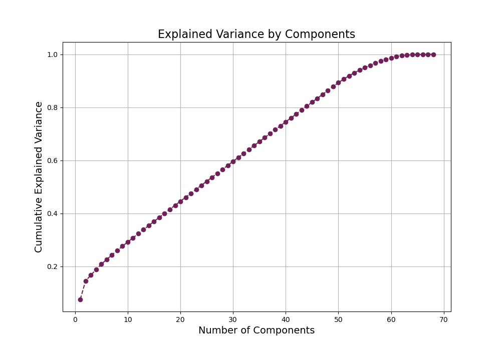
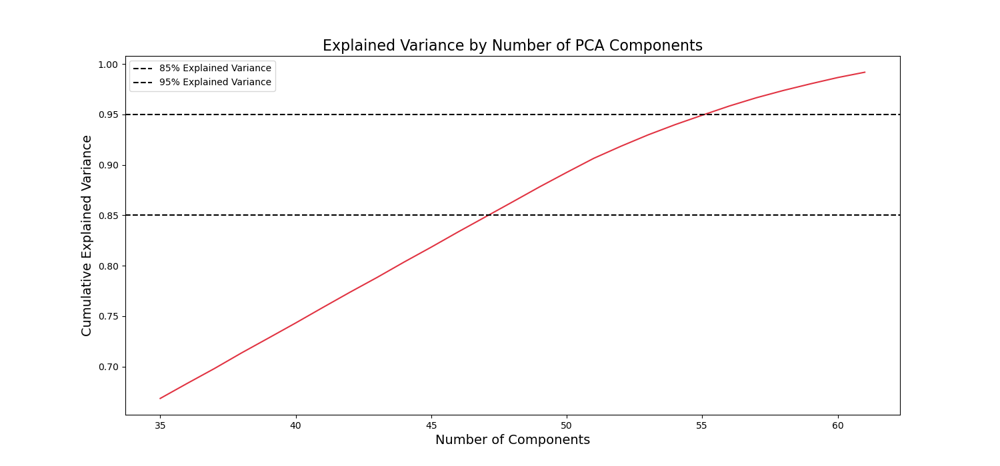

# US news and World Reports University and College Challenge

This analysis is a sample challenge to analyze data from the World Reports on College performance for 2016 data using only Python-derived tools focusing more on visualization and analysis versus machine learning. As part of the challenge, perform a PCA analysis using only Python-derived tools.  The challenge concludes with an over-zoom presentation so a [final powerpoint](./presentation/US_News_and_reports_2016_colleges.pdf) is the deliverable.

## Scenario: 

You are working with a firm that provides consulting services for institutions of higher learning. The team has gathered some data about several schools, and they are hoping you can identify some meaningful insights that could help them as they advise various colleges and universities this year.

## Technologies Used
* Python
* Pandas
* GeoPandas
* MatPlotLib
* Seaborn
* D-Tales
* Panda Profiling
* ScKit Learn (Basic ML)
* PowerPoint

[Requirements File](./requirements.txt)

## Raw Data

​* [Raw Data](./data/original_data/Universities.xlsx)
* [Shape Files](./data/original_data/)

The raw data comes from the US News and World Reports College data for 2016 and the geographic shape file data comes from the US Department of Geography, 2020.

## Analysis Files

### New Tools (Experimental examples)

As part of the presentation, we included some new Python tools that make EDA more accessible, interactive and flexible with less coding. These tools were used against the 2016 US News and World Reports University and College.

* [D-tale EDA Notebook](./notebooks/D-Tale-self-service.ipynb)
* [Panda Profiling EDA Notebook](./notebooks/Panda_profiling.ipynb)

### ETL and Outlier Reports

* [Raw descriptive statistics and outlier](./notebooks/Distribution-Outlier-Basic-states.ipynb)
* [Rudimentary ETL with Additional Data Sources](./Additional_data_Gathering.ipynb)

As part of the data, we geocoded all colleges and data as well as added the original data US news and Reports Regional classification (North, West, South, Midwest) based on location state data.  The geocoding was not perfect and required 5-6 manual corrections in the data ( done via Python). 

In general, public schools tended to be outliers in people per class and the total size of the university.  Private schools were more likely to be outliers for cost, and Ph.D. lecturers.

We concluded most outliers are relevant data. Two noticeable exceptions.  In students per instructors, several schools were outliers being outside of the IQR range on the low end.  This data was easily corrected via search.

On missing data, 10 schools often failed to include their graduation rates.  Instead of imputing the data, we opted to correct the data via a search from the original schools.  Many more schools failed to provide details on overall living expenses outside of the base tuition, so we focused the analysis on other factors.

### EDA and Core Analysis 

#### [Core Analysis Jupyter File](./analysis.ipynb)

In general, private schools and public schools act as different classes.  Private schools have a higher undergraduate graduation rate, a lower student-to-faculty ratio, and cost much more. Even comparing out-of-state costs with private costs, we can see that private schools cost significantly more.

What is slightly more interesting, is that if we apply the original US news and World report regions (North, West, South, Midwest) we can significant differences in cost per region ( ANOVA fvalue=22.97054536966959, pvalue=7.732162944526283e-14), and significant differences in graduation rates per region ( ANOVA p-value= 0.0, fvalue=47.13* ).

If interested check out the full [PDF presentation here](./presentation/US_News_and_reports_2016_colleges.pdf).

### PCA Reduction

#### [Jupyter Notebook PCA Reduction](./pca_reduction.ipynb)

As part of the challenge, we conducted to a PCA reduction to see if it was possible to reduce the features of this data for further machine learning analysis. Initially, we dropped columns with unique values or high cardinality which included 'Address1', 'Address2', 'Latitude', 'Longitude','Zip Code', 'Region', and 'County'.   This left a shape with 19 columns.

Once these columns were hot-encoded to binary columns, we were left with 68 columns.

Our initial pass at the PCA produced a scree sheet that looked like this: 

Our Scree chart shows a relatively linear drop for expected variance as we reduced the dimensions.  Our data did not seem to have a cut off point where columns were superfluous. 

Looking further, we can see the expected variance for different levels of components:

****************************************************

## Final Analysis

The full analysis and presentation notes have far more details then we covered in this readme.  Feel free to checkout the full slide deck below.

* [PDF Version](./presentation/US_News_and_reports_2016_colleges.pdf)
